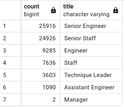
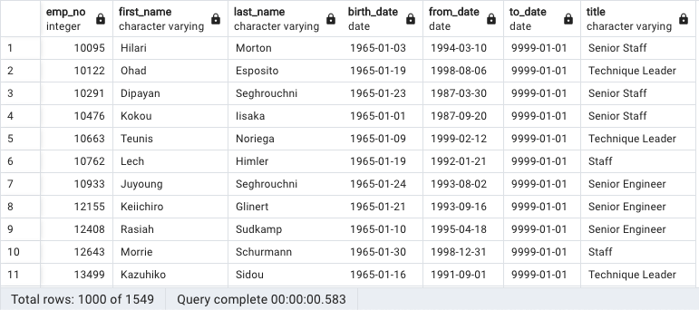

# Pewlett-Hackard-Analysis

## Purpose of this analysis.
### The purpose of this anaylsis was to determine the number of retiring employees per title, and identify employees who are eligible to participate in a mentorship program.

## Results
###
Deliverable 1: The Number of Retiring Employees by Title
* There are 72,459 employees eligible for retirement.
* The largest amount of employees(50,842) retiring are in senior positions.

Deliverable 2: The Employees Eligible for the Mentorship Program
* There are over 1000 employees eligible to serve as mentors for newer employees.
* The mentors span all departments of the company.

## Summary: 
### How many roles will need to be filled as the "silver tsunami" begins to make an impact?
#### There are 72,459 employees who will be retiring in the near future.

### Are there enough qualified, retirement-ready employees in the departments to mentor the next generation of Pewlett Hackard employees?
#### There are 1550 employees who are eligible for the mentorship program.  Based on that number, the mentors would need to advise a large group of new employees to train them for the future.
